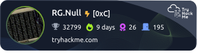

# Rootless.Ghost

<h1 align="left"></h1>

###

## 
[Click to view my THM profile](https://tryhackme.com/p/RG.Null)

  

## Certs
 

## 🎯 What I Do

**Red Team**
- 🔓 Penetration Testing & Security Research
- ⚔️ Red team operations & exploitation
- 🏢 Active Directory & Windows exploitation
- 🌐 Network security & privilege escalation

**Blue Team**
- 🛡️ Threat detection & incident response
- 📊 SIEM analysis & log correlation
- 🔍 Threat hunting & malware analysis
- 🚨 Security monitoring & alerting

<!--## 🏆 Certifications & Achievements  ← NEW SECTION HERE
[Certification section]
-->

## 🎯 Current Focus

- Expanding into purple team operations
- Building detection & response capabilities
- Certification preparation

## 🔬 Lab Environments

- Active Directory lab (attack & defense)
- Web vulnerability testing environment
- WiFi penetration testing lab
- 🚧 SIEM/Detection lab (in progress)

<!--## 📝 Featured Projects (if you have/make any):

##- Pentesting documentation/notes repository
##- Custom scripts or tools
##- Write-ups from labs/CTFs
##- Your Obsidian pentesting vault (public version)
-->
## 🖥️ Operating Systems

    

## 🔧 Security Tools

**Offensive**
 
 

**Defensive**

##

"Stay Humble, Keep Hacking."

###
